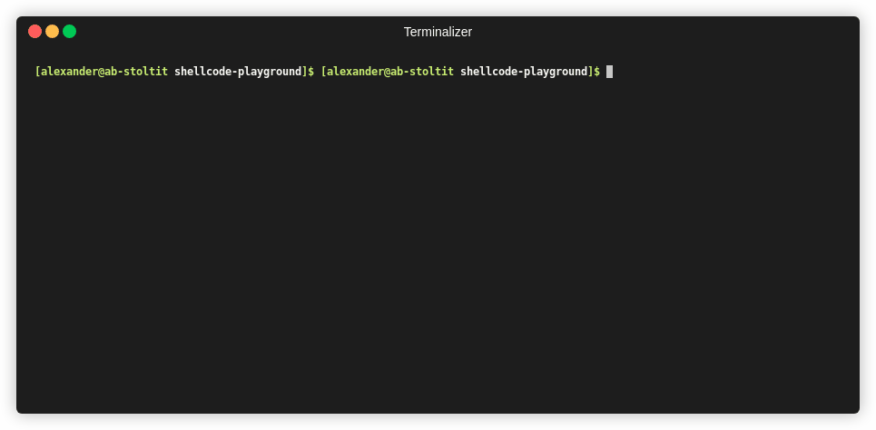

# General

This repository is set up to build all `.c`, `.asm` and `.asm64` in the root of this directory.
The intention is to make it easy to experiment writing shellcode.

The `.c` source will be compiled to `filename` for 32 bit and  `filename64` for - you guessed it - 64 bit!

In this repository you will find working shellcodes for x86 and x86_64. These were found on the internet and I had a hard time tracking down the original source.
They are both a very literal "This needs to be this way" in a simple and straight forward manner.

I added my own comments.

## Get started

Be on a linux machine.

Install dependencies:

* nasm
* gcc
* ld
* make

Alternatively edit Makefile to suit your needs.

## Add or edit files

Please suffix x64 assembly with `.asm64`.

## Make and have fun

    make

### Run shellcode for 32 bitc

    ./bin/shellcoderun (echo -n -e (make raw | grep -v printf | grep -w 'shell' | awk '{print $2}' -))

### Run shellcode for 64 bitc

    ./bin/shellcoderun64 (echo -n -e (make raw | grep -v printf | grep -w 'shell64' | awk '{print $2}' -))

### Get shellcodes

    make raw | grep -v print
